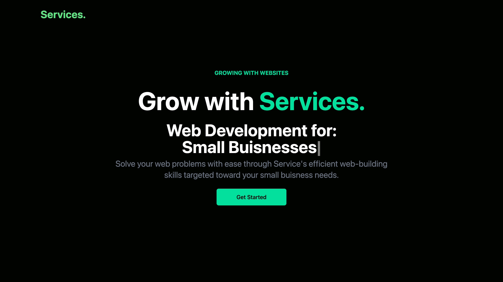

# Services

## Table of Contents
- [Description](#description)
- [Installation](#installation)
- [Usage](#usage)
- [Contributions](#contributions)
- [Test](#test)
- [Contact](#contact)
- [License](#license)

## Description
Services is a cutting-edge project developed using React and Tailwind, delivering a modern, responsive UI. Designed to serve as a versatile template for website-seeking companies, it empowers businesses to engage customers effectively while showcasing their services. This project seamlessly integrates React, JavaScript, HTML, Tailwind and CSS

See [this link](https://sarahgjacobs.github.io/services/) to view the page.

## Technologies Used

- : JavaScript library for building user interfaces. React: JavaScript library for building user interfaces.
- : Utilized the Tailwind CSS framework for creating a sleek and responsive design.
- : Utilize a modern CSS framework (e.g., Bootstrap, Tailwind CSS) for a sleek and responsive design. CSS Framework: Utilize a modern CSS framework (e.g., Bootstrap, Tailwind CSS) for a sleek and responsive design.

## Installation & Usage
Clone the repository

Navigate to the project directory: cd Services

Start the development server: npm start

Open your browser and visit: http://localhost:3000

## Contributions
Sarah Jacobs

Thanks to [Code Commerce](https://youtu.be/ZU-drSVodBw?si=igAW4GBbbPPOouEl)
## Test
N/A

## Contact
For more information please contact: [sgjacobs14@gmail.com](mailto:sgjacobs14@gmail.com)
Or visit my GitHub page at: [sarahgjacobs]

## License 
    This software is licensed under MIT License

##
Thank you for choosing Services as your interactive Service platform! We hope you enjoy using it and sharing your services with the world. Happy serving!
